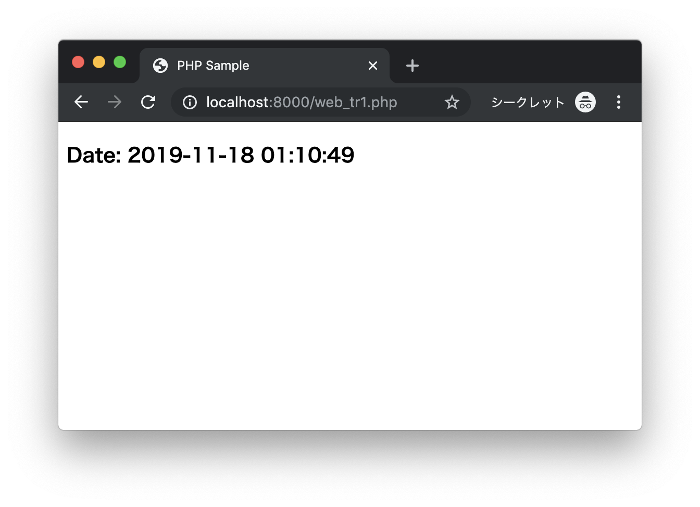
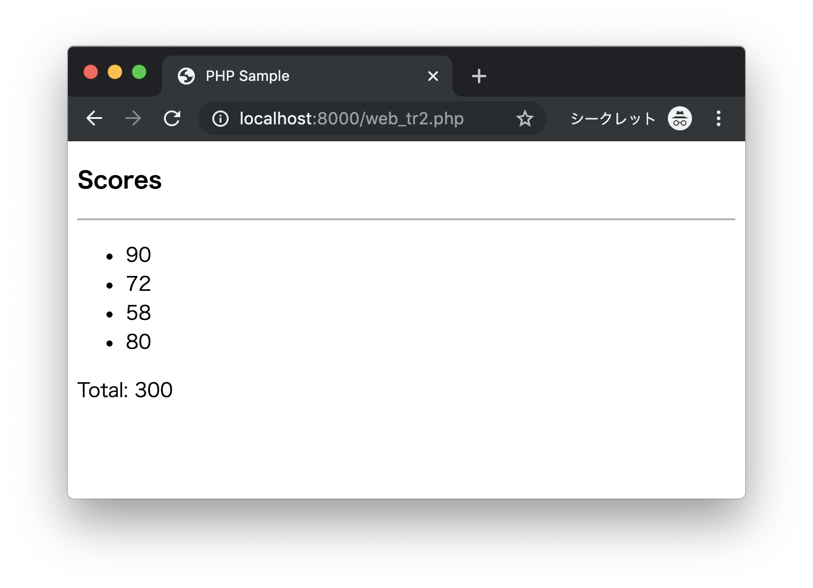
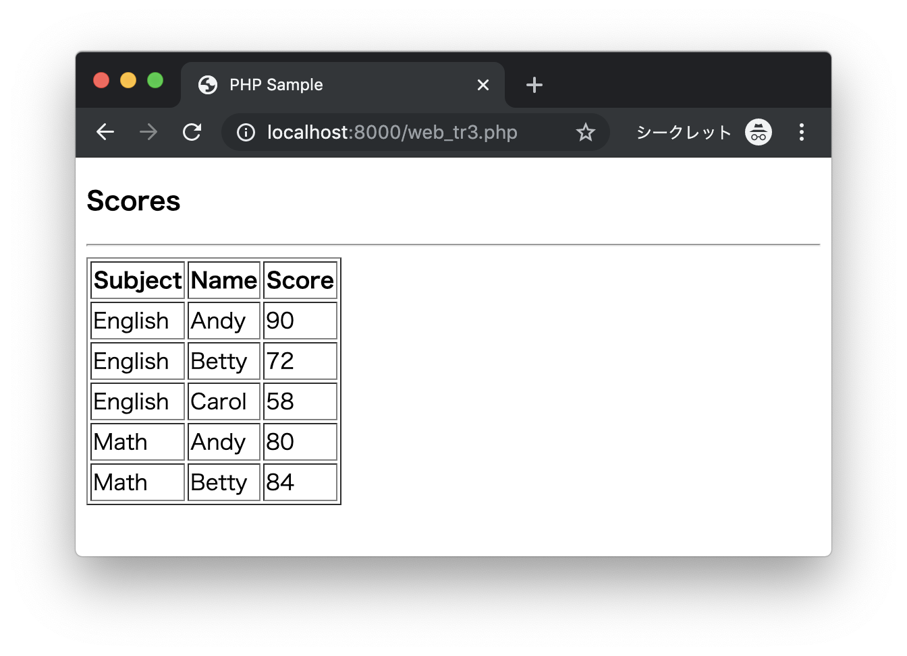

# トレーニング

## web_tr1.php

次のプログラムがあります。

```php
<?php
$date = date("Y-m-d H:i:s");
?>
```

次の実行結果となるようにプログラムを作成してください。

### 実行結果

```
http://localhost:8000/web_tr1.php
```



---

## web_tr2.php

次のプログラムがあります。

```php
<?php
$scores = [90, 72, 58, 80];
$total = array_sum($scores);
?>
```

次の実行結果となるようにプログラムを作成してください。

### 実行結果

```
http://localhost:8000/web_tr2.php
```



---


## web_tr3.php

次のCSVファイル（scores.csv）があります。

```csv
English,Andy,90
English,Betty,72
English,Carol,58
Math,Andy,80
Math,Betty,84
```

次の実行結果となるようにプログラムを作成してください。

### 実行結果


```
http://localhost:8000/web_tr3.php
```




---

