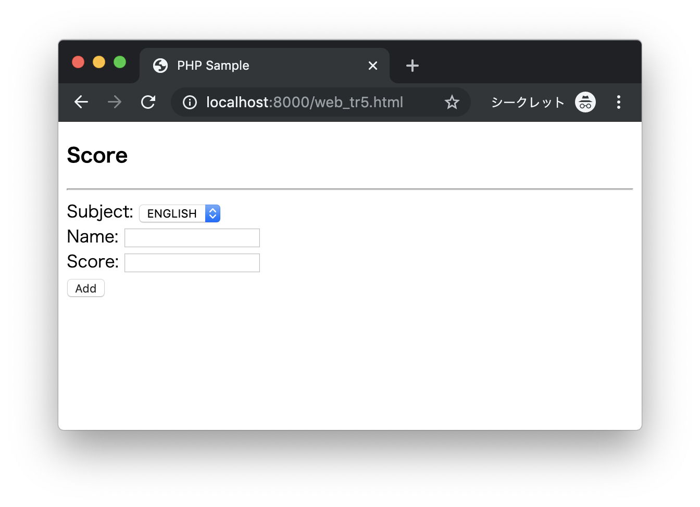
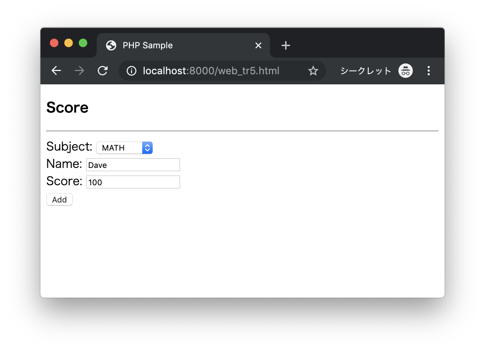
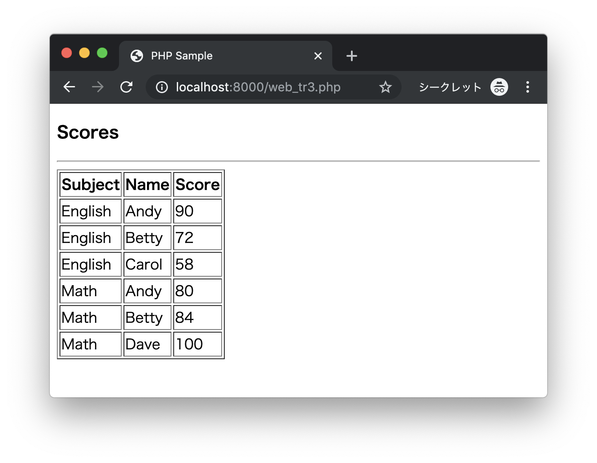

# トレーニング

## web_tr4.php

次のHTMLファイル（web_tr4.html）があります。

```html
<!DOCTYPE html>
<html lang="ja">
<head>
  <meta charset="UTF-8">
  <title>PHP Sample</title>
</head>
<body>
  <h3>Calc</h3>
  <hr>
  <form action="web_tr4.php" method="post">
    <input type="number" name="x">
    +
    <input type="number" name="y">
    <input type="submit" value="Calc">
  </form>
</body>
</html>
```

次の実行結果となるようにプログラムを作成してください。

### 実行結果

```
http://localhost:8000/web_tr4.html
```


2つの数値を入力して`Calc`ボタンをクリックする


2つの数値を加算した結果が画面に表示される


---


## web_tr5.php

次のHTMLファイル（web_tr5.html）があります。

```html
<!DOCTYPE html>
<html lang="ja">
<head>
  <meta charset="UTF-8">
  <title>PHP Sample</title>
</head>
<body>
  <h3>Score</h3>
  <hr>
  <form action="web_tr5.php" method="post">
    Subject:
    <select name="subject">
      <option value="English">ENGLISH</option>
      <option value="Math">MATH</option>
      <option value="Science">SCIENCE</option>
    </select>
    <br>
    Name: <input type="text" name="name"><br>
    Score: <input type="number" name="score"><br>
    <input type="submit" value="Add">
  </form>
</body>
</html>
```

次の実行結果となるようにプログラムを作成してください。

### 実行結果

```
http://localhost:8000/web_tr5.html
```



`Subject`、`Name`、`Score`を数値を入力して`Add`ボタンをクリックする



登録したスコアが画面に表示される



> `web_tr5.php`では入力されたデータを`scores.csv`ファイルにレコードを追記し、`web_tr3.php`にリダイレクトするように実装します。

---


## web_tr6.php

次のHTMLファイル（web_tr6.html）があります。

```html
<!DOCTYPE html>
<html lang="ja">
<head>
  <meta charset="UTF-8">
  <title>PHP Sample</title>
</head>
<body>
  <h3>Score</h3>
  <hr>
  <form action="web_tr6.php" method="get">
    Subject:
    <select name="subject">
      <option value="English">ENGLISH</option>
      <option value="Math">MATH</option>
      <option value="Science">SCIENCE</option>
    </select>
    <br>
    <input type="submit" value="Search">
  </form>
</body>
</html>
```

次の実行結果となるようにプログラムを作成してください。

### 実行結果

```
http://localhost:8000/web_tr6.html
```


`Subject`を選択して`Search`ボタンをクリックする


選択した`Subject`のスコアが画面に表示される


> `scores.csv`ファイルから該当するレコードを検索して、画面に表示します。

---
