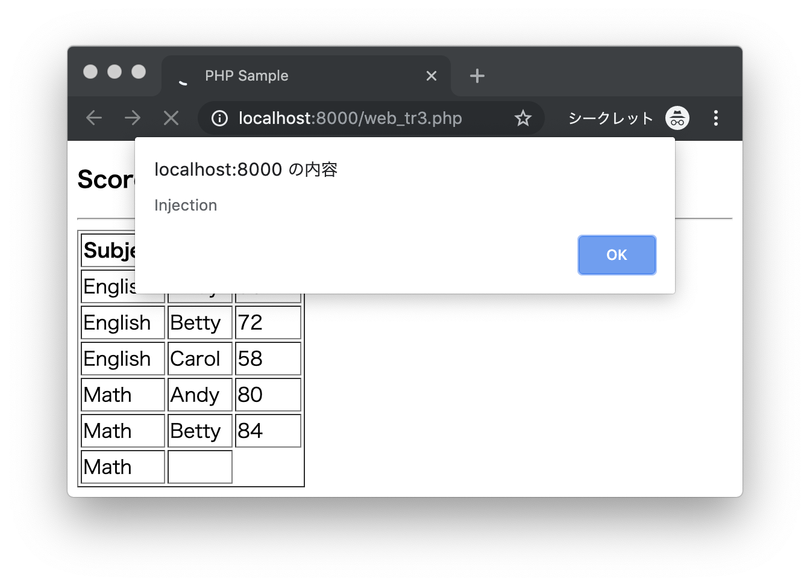
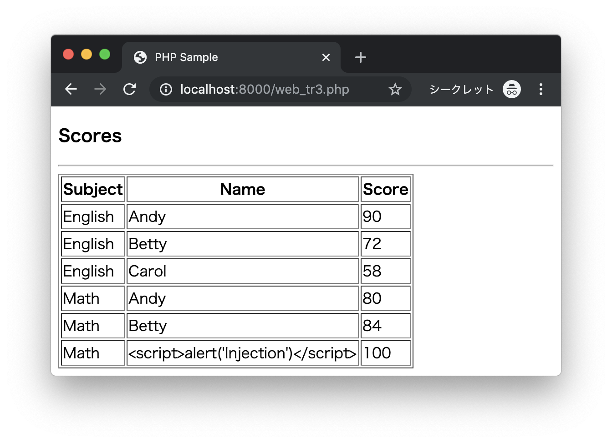
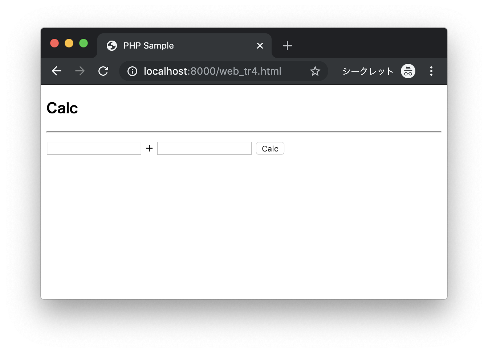
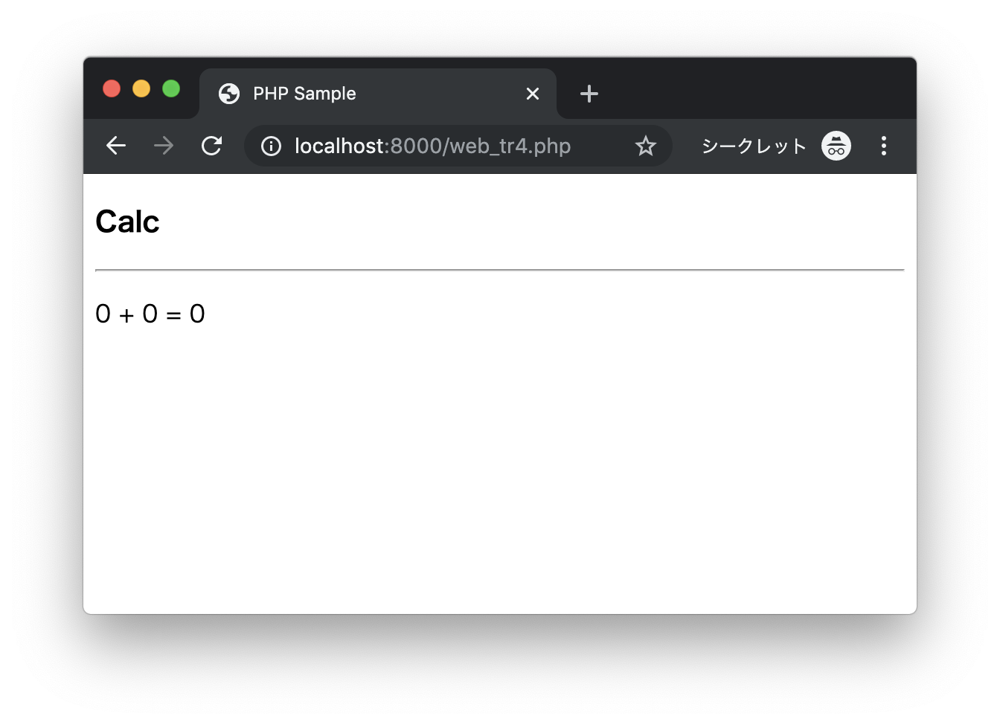

# トレーニング

## web_tr7.php

次のPHPファイル（web_tr7.php）があります。

```php
<?php
???();
$cart = [];
if (isset(???["cart"])) {
  $cart = ???["cart"];
}
if (isset($_GET["item"])) {
  $cart[] = $_GET["item"];
}
???["cart"] = $cart;
$items = implode(",", $cart);
?>
<!DOCTYPE html>
<html lang="ja">
<head>
  <meta charset="UTF-8">
  <title>PHP Sample</title>
</head>
<body>
  <h3>Shop</h3>
  <p>Cart: <?php echo $items; ?></p>
  <hr>
  <ul>
    <li><a href="web_tr7.php?item=apple">Apple</a></li>
    <li><a href="web_tr7.php?item=orange">Orange</a></li>
    <li><a href="web_tr7.php?item=lemon">Lemon</a></li>
  </ul>
</body>
</html>
```

次の実行結果となるようにプログラムを作成してください。

### 実行結果

```
http://localhost:8000/web_tr7.php
```


Appleのリンクをクリックする


Orangeのリンクをクリックする


> 画面の`Cart`欄に選択されたものが追加されるように実装します。

---

## web_tr3.php - 修正

次のCSVファイル（scores.csv）があります。

```csv
English,Andy,90
English,Betty,72
English,Carol,58
Math,Andy,80
Math,Betty,84
Math,<script>alert('Injection')</script>,100
```

> ファイルに不正なスクリプトが登録されています。

次のPHPプログラム（web_tr3.php）があります。

```php
<?php
$fp = fopen("scores.csv", "r");
$scores = [];
$line = fgetcsv($fp);
while ($line !== false) {
  $scores[] = $line;
  $line = fgetcsv($fp);
}
fclose($fp);
?>
<!DOCTYPE html>
<html lang="ja">
<head>
  <meta charset="UTF-8">
  <title>PHP Sample</title>
</head>
<body>
  <h3>Scores</h3>
  <hr>
  <table border="1">
    <tr>
      <th>Subject</th>
      <th>Name</th>
      <th>Score</th>
    </tr>
    <?php for ($i=0; $i < count($scores); $i++) { ?>
    <tr>
      <td><?php echo $scores[$i][0]; ?></td>
      <td><?php echo $scores[$i][1]; ?></td>
      <td><?php echo $scores[$i][2]; ?></td>
    </tr>
    <?php } ?>
  </table>
</body>
</html>
```

`htmlspecialchars`関数によって出力データをエスケープするように修正してください。

### 実行結果 - 修正前

```
http://localhost:8000/web_tr3.php
```



> CSV上のJavaScriptコードが実行されてしまうことを確認します。

### 実行結果 - 修正後

```
http://localhost:8000/web_tr3.php
```



> CSV上のJavaScriptコードがエスケープされていることを確認します。

---


## web_tr4.php - 修正

次のPHPファイル（web_tr4.php）があります。

```php
<?php
$x = $_POST["x"];
$y = $_POST["y"];
$z = $x + $y;
?>
<!DOCTYPE html>
<html lang="ja">
<head>
  <meta charset="UTF-8">
  <title>PHP Sample</title>
</head>
<body>
  <h3>Calc</h3>
  <hr>
  <p>
    <?php echo $x; ?>
    +
    <?php echo $y; ?>
    =
    <?php echo $z; ?>
  </p>
</body>
</html>
```

2つの入力データについて、`filter_input`関数を使ってデータを取得するように実装してください。


### 実行結果 - 修正前

```
http://localhost:8000/web_tr4.html
```



未入力の状態で`Calc`ボタンをクリックする


> 画面に警告メッセージが表示されてしまうことを確認します。

### 実行結果 - 修正後

```
http://localhost:8000/web_tr4.html
```


未入力の状態で`Calc`ボタンをクリックする



> 未入力時は0に置き換えて処理されることを確認します。


---
